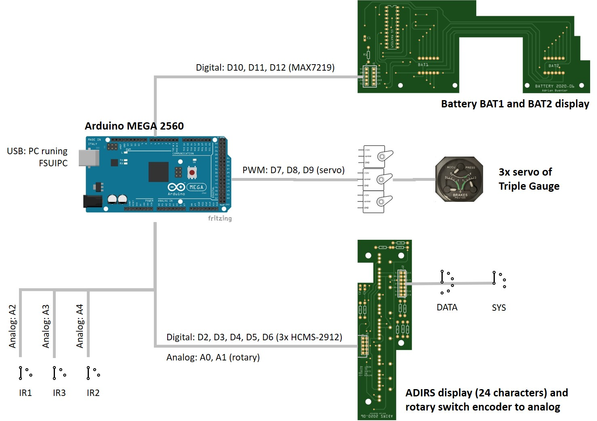
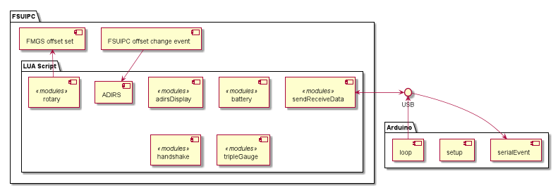

## System Overview

### Hardware Overview

Figure 1-1 depicts the full project from a hardware point of view.

I selected the Arduino MEGA 2560 because the digital I/O's #2 up to #13 support PWM. Therefore, I could use all 
libraries with their default PIN assignments. However, If one would like to use the Arduino UNO, it  is also possible. 
The PINs assigned for the servo's must support PWM, e.g. PIN #3, #5, and #6.

The battery and ADIRS PCB fit into the Overhead panel of Flight Deck Solutions. It is easy adapting the mechanics of the 
PCB in the [Fritzing](https://fritzing.org/) tool.

The battery PCBA uses the MAX7219 to drive the 8 digits of the battery display (2x 4 digits). Hence, any hardware that 
is compatible with the MAX7219 can be used, e.g. 
[8 Char Segment-Display with MAX7219](https://www.play-zone.ch/en/8-zeichen-segment-display-mit-max7219.html?___from_store=de) 
(2020.07).

The ADIRS PCBA includes the dot matrix display modules of Broadcom Limited. I used 3x 
[HCMS-2912](https://www.digikey.ch/product-detail/en/broadcom-limited/HCMS-2912/516-1174-5-ND/637438) (2020.07). 
Together, 24 characters are available. This is sufficient to display the present position as `N 30°29,96'  W086°30,68'`. 
The ADIRS display in the real A320 aircraft doesn't use dot matrix display. But the Broadcom modules are the only 
display modules I found that fit into the Overhead panel. 

### Software Overview

Figure 1-2 shows the components of the ADIRS project.

The LUA script ADIRS.lua is executed by FSUIPC or the WideFS client. The whole script is based on Flight Simulator 
offset changes and, hence, is fully event driven.

On the Arduino side, the serialEvent() function is executed after the loop() function (see Arduino documentation). 
serialEvent() reads one full command and stores it for the loop() to be processed. Information sent back to the Flight 
Simulator are being processed within the loop().
