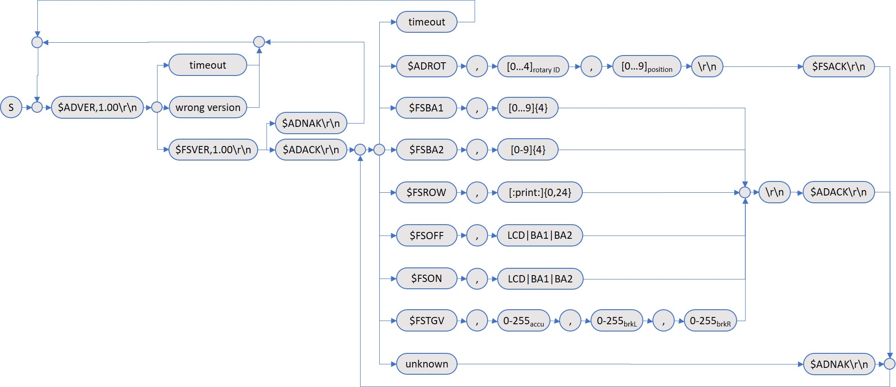

## Protocol
This section describes the protocol used between the Arduino board and the LUA script off the PC.

### Data Link Layer
The Ethernet shield cannot be used due to the limitation of digital and analog I/O's of the 
Arduino UNO board. Hence, message queueing such as MQTT cannot be used. Therefore, a serial
communication between the Arduino board and the LUA script has been selected.

The serial interface configuration is 115200bps, 8bit, no-parity, 1 stop bit (115200-8N1). This
gives a throughput of 11'520 bytes per second. If the battery and the ADIRS display is updated
every 200ms, the protocol size per message must not exceed 1KB - which is rather large for this
application.

Based on the above assumptions, the protocol design uses ASCII representation of the commands
sent. This allows easier testing and debugging on the protocol level.

### Message Structure
The message structure, derived from the [NMEA 0183](https://en.wikipedia.org/wiki/NMEA_0183)
used by GPS receivers for example, uses a simple ASCII serial communication structure.

- All transmitted data are printable ASCII characters (0x20 (space) to 0x7E '~')
- The message has a maximum length of 33 bytes (including the delimiters '$' and CR/LF)
- Data fields are optional
- Reserved characters are:

|ASCII|HEX|Use|
|-----|---|---|
|CR|0x0D|carriage return|
|LF|0x0A|line feed|
|$|0x24|start message character|
|,|0x2C|field delimiter|

A sample message structure shown below:
- The message starts with the character '$' (0x24)
- The next maximum five characters identify the talker ('AD' Arduino, 'FS' FlightSim) and
the type of message (two to three characters).
- All data fields are comma-delimited.
- At least one byte must be included in a data field if present.
- The message ends with 0x0D (CR) and 0x0A (LF).

The following example shows the rotary position sent from the Arduino to the PC:
- `$ADROT,0,1\r\n`

The above message will be acknowledged by the FlightSim as follows:
- `$FSACK\r\n`

### Protocol Description

The following picture shows the protocol used. Every command but `ADVER` requires an
acknowledgement before another command can be sent from either talker.

#### Handshake
The Arduino board initiates the communication by sending the protocol version `$ADVER,1.00\r\n`.
The FlightSim LUA script sends the version back, if it can support it, e.g. `$FSVER,1.00\r\n`.
Finaly, the Arduino board acknowledges the protocol version with `$ADACK\r\n`.

If the Arduino board doesn't receive any messages within a given time (timeout occurs), it will
resend the protocol version (heartbeat) to the FlightSim. This handles USB communication
interrupts that may occur occasionally. The picture below shows the state diagram used within
the Arduino script.

The LUA script implements the following communication states:

#### Commands

|start|Command| |Data (regex)         |end |Description|
|---|-------|---|---------------------|----|-----------|
|$|ADROT|,|`^[0-4],[0-9]$`            |\r\n|field1: rotary switch ID: 0-DATA, 1-SYS, 2-IR1, 3-IR3, 4-IR2 field2: rotary position|
|$|FSBA1|,|`^[0-9]{4}$`               |\r\n|Battery1 voltage (*10), e.g. 0238 for 23.8 volts|
|$|FSBA2|,|`^[0-9]{4}$`               |\r\n|Battery1 voltage (*10), e.g. 0238 for 23.8 volts|
|$|FSROW|,|`^[\x20-\x7e]{0,24}$`      |\r\n|Display text in ADIRS|
|$|FSOFF|,|`^(LCD\|BA1\|BA2)$`|\r\n|Switch OFF ADIRS, battery1, or battery2 display|
|$|FSON |,|`^(LCD\|BA1\|BA2)$`|\r\n|Switch OFF ADIRS, battery1, or battery2 display|
|$|FSTGV|,|0-255,0-255,0-255          |\r\n|Triple gauge servo values (0-255) 1. value: ACCU 2. value: BREAK left 3. value: BREAK right|
|$|ADACK| |                           |\r\n|Arduino confirms message received|
|$|ADNAK| |                           |\r\n|Arduino rejects received message|
|$|FSACK| |                           |\r\n|FlightSim confirms message received|
|$|FSNAK| |                           |\r\n|FlightSim rejects received message|